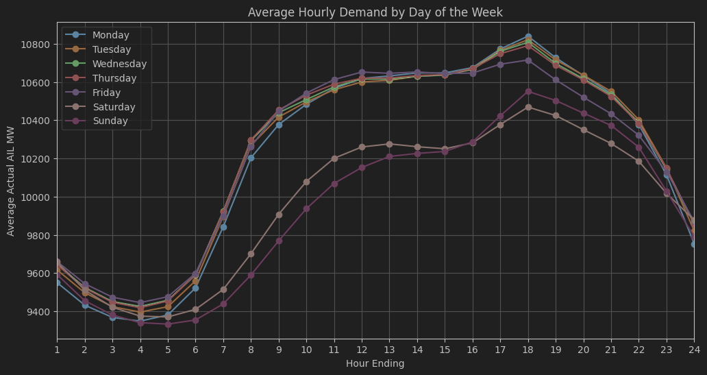
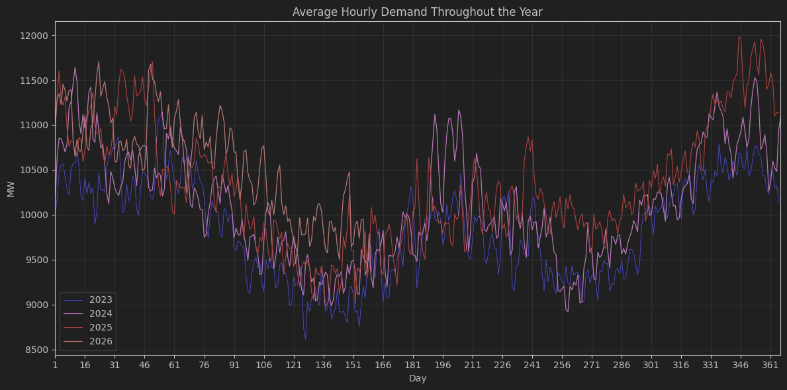
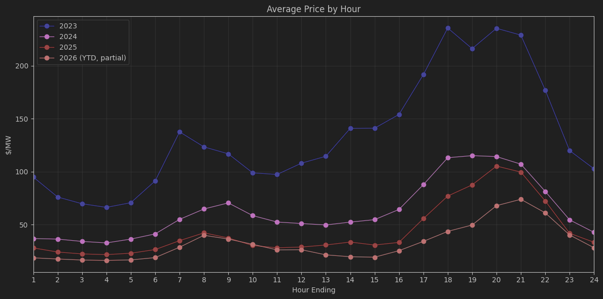
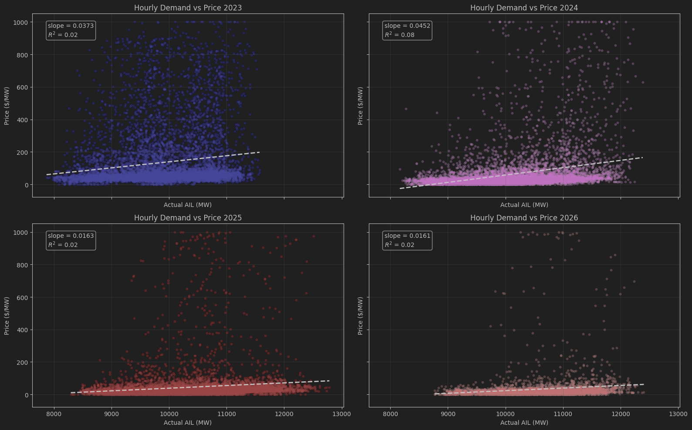
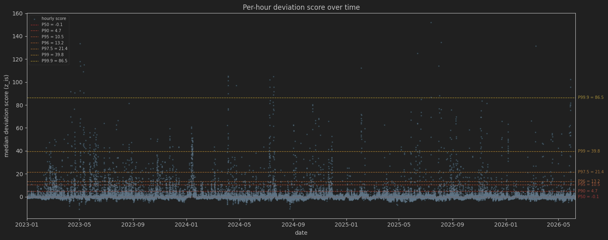
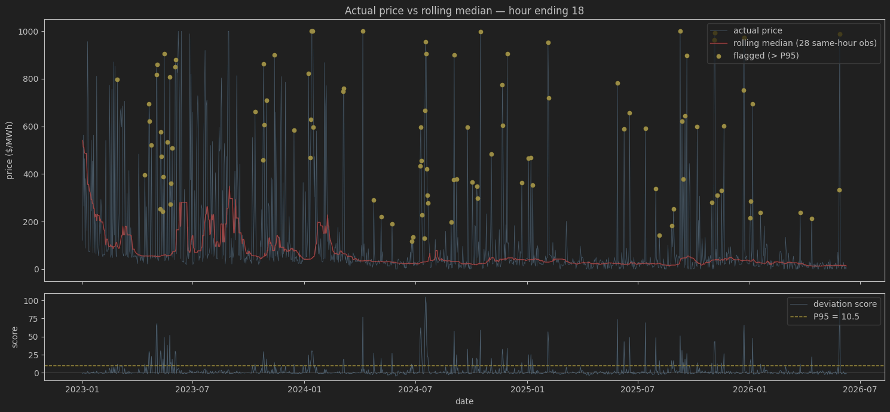
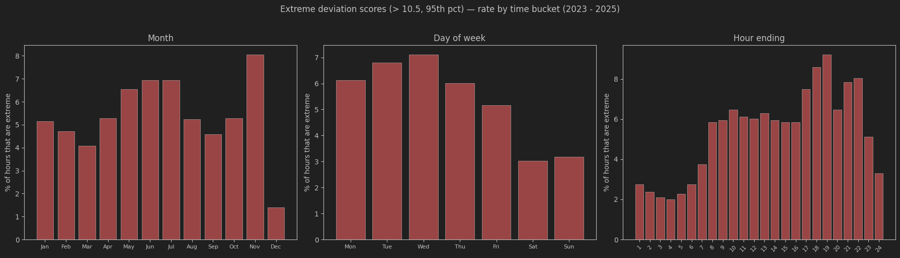

## Alberta Power Market Analysis

This project is to understand the Alberta power market through data analysis by
identifying trends and relationships that are in line with the market's underlying structure, 
and using these understanding to develop models.

### Actual Forecast Data
- **Source**: Alberta Electric System Operator (AESO)
- **Period**: January 01, 2023 - Last updated on June 08, 2026
- **Granularity**: Hourly
- **Columns**: date_he, forecast_price, actual_price, forecast_ail, actual_ail, ail_difference

### Market Context
- Alberta's wholesale electricity market runs on merit order structure where generator bids are sorted
 from least to most expensive and dispatched until demand is met, with the 
 marginal generator setting the clearing price. 
- It is an energy only market where generators are paid for the power they produce. 
- Economic withholding (raising offer prices per MWh) is permitted, 
 but physical withholding (holding capacity back from the market) is not.
- Since the coal phase out in mid 2024, the supply stack now consists of gas fired generators
and renewables, wind turbines and solar panels.
- Renewables have near-zero marginal cost, so they are dispatched first and can suppress 
 marginal price when their output is high. 

## Section 1: Exploratory Analysis

Historical price and demand patterns interpreted against market structure

### Demand Pattern

<table>
  <tr>
    <td></td>
    <td></td>
  </tr>
</table>

- Residential and commercial consumption drive these observed patterns; however, 
 Alberta's production of oil and gas introduces a substantial baseload component, 
 as oil sands extraction requires continuous electricity regardless of time of day.
- Annual demand peaks in winter (Dec–Feb) and summer (Jul–Aug) on heating/cooling load, 
and bottoms out in the milder shoulder months (typically May and September).

### Price

  

- Average hourly prices fell sharply from 2023 into 2024–2026, driven by lower natural gas prices 
 and new gas-fired and renewable capacity entering the grid.
- Natural gas now sets the price level, since gas fired generators are typically the marginal units in the merit order.
- The evening peak holds late, with prices staying elevated even as demand declines.

### Price-Demand Relationship

  

The price-demand scatter plots reveal a marginally positive relationship, though the near-flat slopes suggest almost no linear dependence between the two variables. 
The distribution of the observations is heavily concentrated at a center indicating that for most hours the market is generally well-behaved with some points settling at the `0/MWh` floor 
, and some hours, where prices drift from the norm even reaching the regulatory price cap of `999.99/MWh`.

This pattern is expected given Alberta's merit order market structure. As a result, prices depend on the available supply stack rather than demand. 
Extreme price events are more likely attributed to supply-side shocks such as unplanned outages, constrained generation capacity or congestion on the power line than to demand alone.

The continuous addition of renewable generators adds further complexity to Alberta's price formation. 
An hour of high renewable output coinciding with strong demand can yield lower prices, while an hour dominated by expensive marginal units 
with weak demand can lead to elevated prices.

## Section 2: Detecting outliers

### Method
We want to isolate the points that break away from the cluster using a detector that stays valid even as the market changes from year to year. 
A fixed threshold in raw dollars cannot do this, because price levels shift substantially over time, so the same cutoff flags very different 
things in different years. What we need instead is a detector that responds to price movement relative to context. From the earlier analysis, 
we know prices have a strong hourly structure and cluster around a center, so we use that to score each hour against its own recent history. 
An anomaly is then defined as a departure from what is normal for that hour at that point in time, regardless of the overall price level.

Concretely, each hour is scored against its own recent history for that hour-of-day:

- **Baseline** — the median of the 28 most recent prior observations (roughly a month of trailing history), excluding the current hour, 
so the score never depends on the point being judged. The median is used so the baseline is itself robust to the outliers we are trying 
to detect.
- **Score** — the difference between the rolling median and the current value divided by the median of the prior 28 absolute residuals (a rolling MAD), which measures the move against how tightly that hour has recently behaved.
$$
z_i = \frac{r_i}{\text{MAD}_i}
$$
The score is a relative, per-hour ranking, not a calibrated magnitude: a higher score means a more pronounced departure from the hour's recent normal. 
The window length balances two needs, long enough for a stable baseline, short enough to track the substantial shifts in price level over time rather than lag them.

The rolling median and MAD are computed in DuckDB and independently reproduced in pandas, matching exactly.

(Full construction, formulas, and verification in detecting_outliers.ipynb.)

  

### Results

Looking at hour ending 18:00, the flagged hours (gold) sit where price breaks sharply from its rolling base.
Notably, the largest raw spikes in 2023 are mostly not flagged. With the baseline being elevated then, another high
print is not a departure. Between 2024-2026, smaller excursions are flagged because they stand out
against a quiet baseline, the detector measures distance from recent normal, not absolute price.

  

Grouping the flagged hours by rate across month, day of week, and hour of day, we get

  

The hour-of-day has a similar shape to the hourly price by hour curve from section 1, where anomalies
concentrate at the evening system peak. The day-of-week echoes this where weekdays flag at 5 to 7 percent 
against about 3 percent on weekends, and November stands above every other month.

Because this detector flags departures from recent normal, it misses high prices that occur when the baseline is already elevated, 
the frequent spikes of 2023, for instance. Those hours still break from the long-run price-demand relationship in Section 1 and are of interest, 
but isolating them is a different question than the one this detector answers.

## Section 3: Demand Forecasting

### SARIMA Model

### XGBoost Model